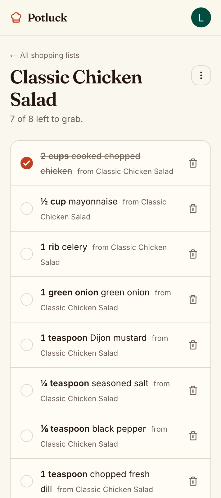
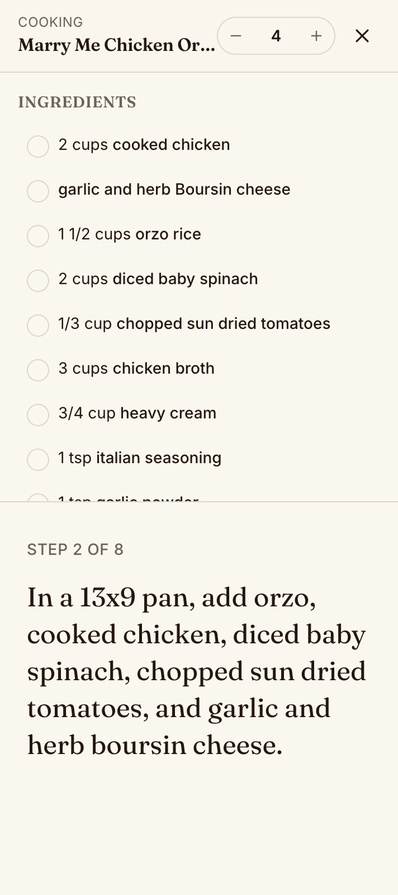

# Potluck

> The cookbook you build with everyone you cook for. Snap a photo of any
> recipe — handwritten card, magazine page, screenshot — and AI turns it into
> a clean, editable recipe card. Organize collections, browse friends'
> kitchens, cook hands-free. Mobile-first PWA, single-file SQLite, Google
> sign-in.

<p align="center">
  
  
  
</p>

> Screenshots above live in `docs/screenshots/` — drop new PNGs in once
> you've taken them. The README references the file names so it'll just work.

---

## Features

- **Photo → recipe** — one or many photos go in (handwritten included),
  a structured recipe card with ingredients, steps, and metadata comes
  out. Powered by `gpt-4o` vision via the Vercel AI SDK.
- **URL import** — paste a recipe URL, get the same structured card,
  but at ~17× lower AI cost (`gpt-4o-mini` on stripped HTML).
- **Per-user AI spend cap** — defaults to **$2 / month**. Soft-falls
  back to the cheap model at ⅔ of the cap so users keep working.
- **Collections** — group recipes into `Mom's Recipes`, `Weeknight
  Dinners`, anything. Public, unlisted, or private. The default
  "All Saves" collection is created on first save.
- **Cook mode** — full-screen, big-text, step-by-step UI with a screen
  wake-lock and a servings scaler that re-multiplies fractions in
  ingredient text.
- **PWA + offline cooking** — install to home screen on iOS/Android.
  Hand-rolled service worker caches the app shell, photos, and pages
  you've visited, so you can pull up a recipe at the stove without
  signal.
- **Search + filters** — SQLite FTS5 full-text + URL-driven filter
  chips (max time, meal type, cuisine, diet).
- **Single-file backup** — the entire database is one SQLite file at
  `data/potluck.db`. Photos sit in `data/uploads/`.

---

## Quickstart (5 minutes)

```bash
pnpm install                    # if pnpm asks, run `pnpm approve-builds --all`
cp .env.example .env.local      # then fill in keys (see below)
pnpm db:push                    # creates data/potluck.db
pnpm dev                        # http://localhost:3000
```

Visit http://localhost:3000, click **Sign in**, finish the Google
OAuth flow, and you're in. Add a recipe from `/add` — point it at any
photo of a recipe in your camera roll, and watch the structured card
build itself.

### Required env vars

You need three things in `.env.local` to boot:

| Var | What | Where |
| --- | --- | --- |
| `AUTH_SECRET` | Auth.js session signing | `openssl rand -base64 32` |
| `AUTH_GOOGLE_ID` + `AUTH_GOOGLE_SECRET` | Google OAuth client | [Google Cloud Console](https://console.cloud.google.com/apis/credentials) — set redirect URI to `http://localhost:3000/api/auth/callback/google` |
| `OPENAI_API_KEY` | Photo / URL recipe extraction | [OpenAI dashboard](https://platform.openai.com/api-keys) |

`.env.example` lists every optional knob too — model overrides, AI spend
cap, allow-list of email addresses, custom data directory, etc.

### Optional but useful

```bash
pnpm dev:signin          # mints a dev-only session for fast iteration
pnpm db:seed             # seeds a few demo recipes
pnpm db:studio           # Drizzle Studio GUI in your browser
pnpm db:inspect          # quick CLI peek at the SQLite file
```

---

## Architecture in one breath

Next.js 16 App Router (React 19, Server Components, Server Actions,
Turbopack). All data lives in a single SQLite file driven by Drizzle.
Auth is Auth.js v5 with database sessions and Google OAuth only. AI
extraction goes through the Vercel AI SDK + OpenAI structured outputs,
constrained to the same Zod schema the UI form uses, so the model can
never invent a field the form can't render. Styling is Tailwind v4 with
shadcn/ui (`base-nova`) tokens. PWA is hand-rolled — manifest, service
worker, and a cross-platform install prompt — no `next-pwa`.

For the deep dive (every directory, every decision, every gotcha) see
[`DEVELOPMENT.md`](DEVELOPMENT.md).

---

## Scripts

| Command | Purpose |
| --- | --- |
| `pnpm dev` | Next.js dev server (Turbopack) on `:3000` |
| `pnpm build` | Production build |
| `pnpm start` | Run a built app |
| `pnpm typecheck` | `tsc --noEmit` |
| `pnpm lint` | ESLint (flat config) |
| `pnpm test` | Vitest, runs once |
| `pnpm test:watch` | Vitest in watch mode |
| `pnpm format` | Prettier write |
| `pnpm db:push` | Apply schema to local SQLite |
| `pnpm db:generate` | Generate a SQL migration from schema diff |
| `pnpm db:migrate` | Apply pending migrations |
| `pnpm db:studio` | Drizzle Studio GUI |
| `pnpm db:inspect` | CLI peek at row counts + schema |
| `pnpm db:seed` | Seed demo recipes |
| `pnpm dev:signin` | Mint a dev-only session (no Google round-trip) |
| `pnpm test:extract` | Smoke-test the AI extractor against a sample image |

---

## Stack

Next.js 16 (App Router, RSC, Server Actions) · React 19 · TypeScript ·
Tailwind v4 · shadcn/ui (`base-nova`) · SQLite (better-sqlite3) ·
Drizzle ORM · Auth.js v5 (Google) · Vercel AI SDK + OpenAI gpt-4o
(vision) + gpt-4o-mini (URL) · sharp + Blurhash · SQLite FTS5 · Vitest

---

## Project layout

```
potluck/
  app/                       # App Router routes
    (app)/                   # authenticated shell (bottom tab bar)
      feed/  search/  add/  cookbook/  me/
      u/[handle]/            # public profile
      r/[id]/                # recipe detail + cook + edit
    api/auth/                # Auth.js handler
    api/extract/             # photo / URL → structured recipe
    api/ai/spend/            # current month spend + cap
    api/upload/              # multipart photo upload
    offline/                 # PWA fallback page
  components/                # ui/, recipe/, upload/, collection/, nav/, pwa/
  db/                        # schema.ts, client.ts, migrations/
  lib/
    actions/                 # server actions (recipes, collections, saves, profile, feed)
    ai/                      # AI SDK wrapper + spend cap helpers
    queries/                 # query helpers used by RSC pages
    recipe-import/           # URL fetch + HTML strip
    validators.ts            # zod schemas (shared client + server + AI)
  public/
    icons/                   # PWA icons + apple-touch-icon
    sw.js                    # service worker
  data/                      # gitignored: potluck.db, uploads/
  docs/screenshots/          # README screenshots
```

---

## Testing

```bash
pnpm test                  # unit tests (Vitest, Node env)
pnpm test:watch            # watch mode
```

Coverage lives across:

- `db/__tests__/schema.test.ts` — schema invariants, FTS, cascades, the
  `maxMinutes` filter regression test.
- `lib/__tests__/{validators,scale}.test.ts` — pure validator + units
  tests.
- `lib/actions/__tests__/{recipes,collections,saves}.test.ts` — server
  action coverage with mocked auth + an in-memory SQLite per test
  (mirrors the real Drizzle wiring).

The action tests share a small helper (`lib/actions/__tests__/_helpers.ts`)
that builds a fresh in-memory DB, applies migrations, and exposes
seed builders. Each test file owns its own `vi.mock` calls for
`@/lib/auth`, `next/cache`, `next/navigation`, and `@/db/client`.

---

## Documentation

- [`DEVELOPMENT.md`](DEVELOPMENT.md) — architecture, conventions,
  decisions, gotchas. Read this first if you're picking up the project.
- [`TODO.md`](TODO.md) — phased build-out checklist.
- `.cursor/plans/potluck_recipe_app_*.plan.md` — the original product
  plan agreed with the user.

---

## License

Personal project — no public license yet. Don't redistribute the SQLite
file (it's everyone's recipes).
